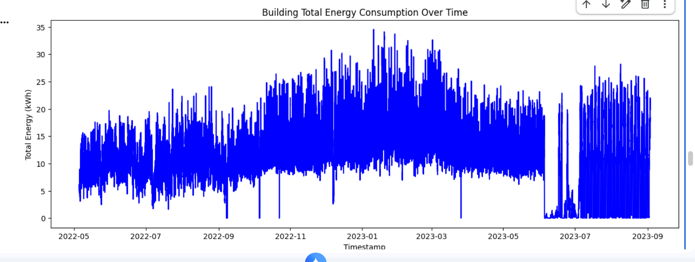
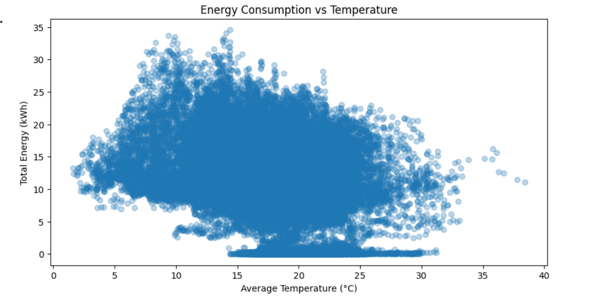
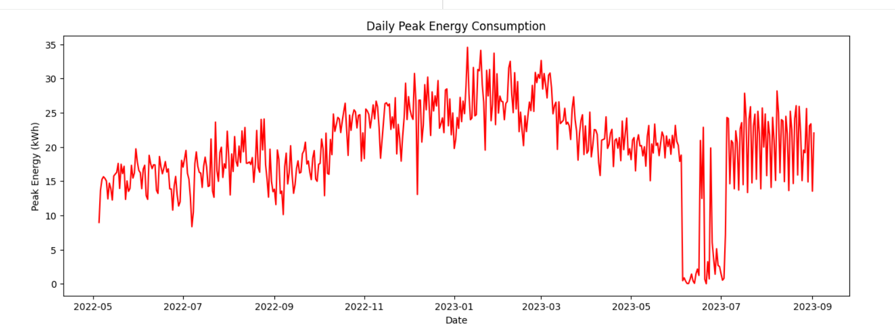

# Building Energy Analytics Pipeline

## Project Overview
Developed a full data pipeline to process electricity consumption data for 172 building meters in Portugal, merged with weather data, and produced an analytics-ready dataset.

## Dataset
- Energy CSV: loureiro_energy.csv
- Weather CSV: weather_aveiro_final.csv
- Final cleaned dataset: final_energy_weather.csv

## Steps Performed
1. Loaded CSV files into Pandas
2. Parsed timestamps for both datasets
3. Reshaped 172 energy meter columns from wide → long format
4. Cleaned missing and negative energy values
5. Aggregated total building energy consumption
6. Merged energy data with weather features
7. Handled remaining missing values via forward/backward fill
8. Saved analytics-ready dataset
9. Created exploratory visualizations

## Technologies Used
- Python, Pandas, NumPy
- Matplotlib / Seaborn (optional)
- Google Colab

  
#  Building Total Energy Consumption Over Time
## Key Insights:
-The total energy consumption shows a clear seasonal pattern, with demand gradually increasing from mid-2022 and peaking during the winter months (December–February).
-Higher winter consumption indicates heating-driven energy demand, which is common in multi-building environments.
-A sharp drop to near-zero consumption in mid-2023 suggests possible operational downtime, building shutdowns, meter outages, or data gaps.
-High variability at 15-minute intervals reflects diverse usage patterns across 172 buildings and validates the need for aggregation and peak analysis.

  
# Energy Consumption vs Temperature
## Key Insights:
-Energy consumption demonstrates a non-linear relationship with temperature.
-Higher energy usage is concentrated at lower temperature ranges (approximately 5°C–15°C), indicating significant heating demand.
-As temperatures increase, overall energy consumption tends to decrease, suggesting cooling demand is less energy-intensive than heating for these buildings.
-The widespread of values highlights operational diversity, influenced by factors such as occupancy, building function, and time of day.
-Near-zero energy values across all temperatures align with observed downtime periods, confirming data consistency across analyses.

  
# Daily Peak Energy Consumption
## Key Insights:
-Daily peak energy demand increases steadily toward winter, reaching maximum values of approximately 30–35 kWh.
-Winter months exhibit higher volatility in peak demand, indicating increased strain on energy infrastructure and higher cost risk.
-The sudden collapse of daily peak energy in mid-2023 aligns with near-zero consumption periods observed in other analyses, reinforcing the likelihood of operational downtime or data interruption.
-After this period, peak energy patterns become more irregular, suggesting partial building reactivation or changes in usage behavior.

# Summary of Findings
-Energy consumption is strongly seasonal and temperature-dependent, with heating driving peak demand.
-Peak energy analysis reveals critical high-risk periods relevant for capacity planning and cost optimization.
-Consistent anomaly patterns across multiple visualizations demonstrate robust data validation and analytical depth.
  

